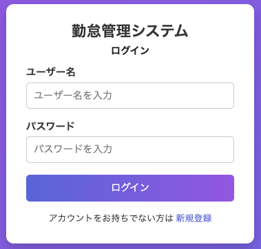
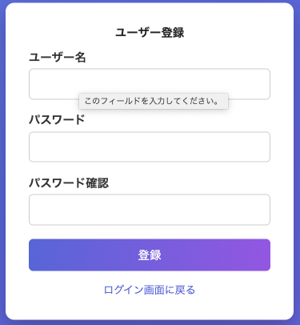
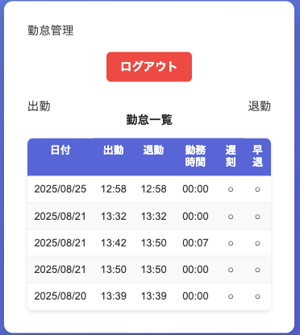

# 勤怠管理アプリ

## 概要
出勤・退勤を記録し、勤怠を簡易表示するWebアプリケーションです。
個人開発のポートフォリオ用に作成しました。

---

## 機能
- ユーザー登録 / ログイン / ログアウト
- 出勤打刻・退勤打刻
- 勤怠一覧表示(最新５件まで)
- 遅刻・早退の判定
- H2 Database
- レスポンシブデザイン

---

## 使用技術
- **言語**: Java 17
- **フレームワーク**: Spring Boot 3.x, Spring Security, Thymeleaf
- **データベース**: H2 Database (開発用)
- **フロント**: HTML / CSS (destyle.css, styles.css)
- **ツール**: Git, Maven

---

## セットアップ方法

### 1. リポジトリをクローン
```bash
git clone https://github.com/ManoTakafumi/springboot-attendanceapp-h2database.git
cd springboot-attendanceapp-h2database

### 2. アプリを起動
./mvnw spring-boot:run

### 3. アクセス
ブラウザでhttp://localhost:8080にアクセス

```

---

## スクリーンショット

### ログイン画面


### 登録画面


### 勤怠一覧


---

## 工夫した点
・　打刻時に最新５件のみ保持する。
・　遅刻・早退を判定して一覧に◯/✖︎で表示
・　レスポンシブデザイン
・　H2 Databaseをファイル保存に切替